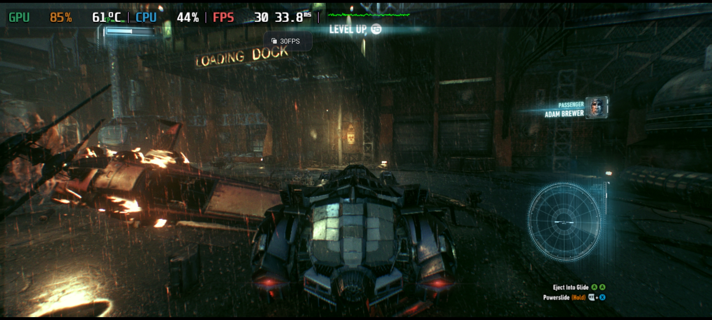

Example off proton wine arm64ec, Arkham Knight 

run this build of proton to get it working with termux bionic: https://github.com/airidosas252/tur

how to get xinput to work on proton-box64

Xinput work 

wget https://github.com/moio9/termux-hwac/releases/download/dll/lib.tar.xz

cd /data/data/com.termux/files/usr/opt/proton-box64

tar xvf ~/lib.tar.xz

or for proton wine arm64ec
cd /data/data/com.termux/files/usr/opt
wget https://github.com/nydal91/Termux-bionic-files-for-emulator-/releases/download/1.0/proton-wine-xinput-nonroot.zip
7z x proton-wine-xinput-nonroot.zip

Download https://raw.githubusercontent.com/moio9/termux-hwac/refs/heads/main/tools/pre_fix.reg
In wine

Open regedit

Import pre_fix.reg

Install termux x11 extra

wget https://raw.githubusercontent.com/moio9/termux-hwac/refs/heads/main/tools/connect_gamepad.py

python connect_gamepad.py

8bitdo:

python connect_8bitdo.py (xbox mode)

build box64:
git clone https://github.com/ptitSeb/box64
cd ~/box64
        mkdir build; cd build; cmake .. -D TERMUX=1 -DCMAKE_C_COMPILER=clang -D CMAKE_BUILD_TYPE=RelWithDebInfo -D BAD_SIGNAL=ON -D SD8G2=ON
   make -j8; make install  

## Termux-X11 extra preferences
* `Display resolution mode` exact
* `Display resolution` 1280x720
* `Reseed Screen While Soft Keyboard is open` OFF
* `Fullscreen on device display` ON
* `Force Landscape orientation` ON
* `Hide display cutout` ON
* `Show additional keyboard` OFF
* `Prefer scancodes when possible` ON
* `hardware keyboard scancode` Off
